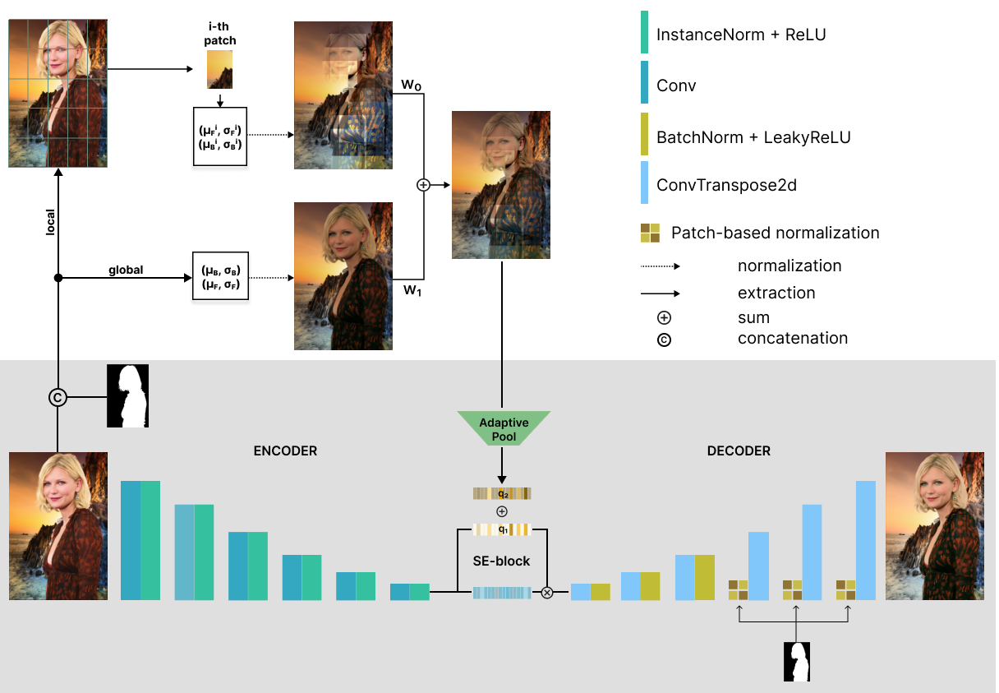

# PHNet: Patch-based Normalization for Image Harmonization

We present a patch-based harmonization network consisting of novel Patch-based normalization (PN) blocks and a feature extractor based on statistical color transfer. We evaluate our approach on available image harmonization datasets. Extensive experiments demonstrate the network's high generalization capability for different domains. Additionally, we collected a new dataset focused on portrait harmonization. Our network achieves state-of-the-art results on iHarmony4 and gains the best metrics on the synthetic portrait dataset.



For more information see our paper [PHNet: Patch-based Normalization for Image Harmonization](https://arxiv.org/abs/2402.17561).

## Installation
Clone and install required python packages:
```bash
git clone https://github.com/befozg/PHNet.git
cd PHNet
# Create virtual env by conda from env.yml file
conda env create -f env.yml
conda activate phnet
```

## Dataset
We present Flickr-Faces-HQ-Harmonization (FFHQH), a new dataset for portrait harmonization based on the [FFHQ](https://github.com/NVlabs/ffhq-dataset). It contains real images, foreground masks, and synthesized composites. 

- Download link: [FFHQH](https://sc.link/P3MXg)


## Model Zoo
Also, we provide some pre-trained models called PHNet for demo usage.

| State file                           | Where to place                                   | Download |
|-----------------------------------|-------------------------------------------|----|
| Trained on iHarmony4, 512x512   |   `checkpoints/`        | [iharmony512.pth](https://n-ws-620xz-pd11.s3pd11.sbercloud.ru/b-ws-620xz-pd11-jux/harmonization/iharmony512.pth)|
| Trained on FFHQH, 1024x1024    |   `checkpoints/`        | [ffhqh1024.pth](https://sc.link/6sIbD) |
| Trained on FFHQH, 512x512    |   `checkpoints/`        | [ffhqh512.pth](https://sc.link/aXZcw) |
| Trained on FFHQH, 256x256    |   `checkpoints/`        | [ffhqh256.pth](https://sc.link/xCxy3) |


## Train
You can use downloaded trained models, otherwise select the baseline and parameters for training.
To train the model, execute the following command:

```bash
python train.py <train-config-path> 
```
where ```train-config-path``` refers to the appropriate configuration file.
You should pass your own config path for customized experiments. Refer to our ```config/train.yaml```  for training details.

## Test
To test the model, execute the following command:

```bash
python test.py <test-config-path>
```
where ```test-config-path``` refers to the appropriate configuration file. Refer to our ```config/test_FFHQH.yaml``` for inference details using ```FFHQH``` checkpoints and ```config/test_iHarmony4.yaml``` for ```iHarmony4``` trained model.

## Authors and Credits
- [Kapitanov Alexander](https://www.linkedin.com/in/hukenovs)
- [Efremyan Karen](https://www.linkedin.com/in/befozg)
- [Petrova Elizaveta](https://www.linkedin.com/in/kleinsbotle/)
- [Kaskov Evgeny](https://linkedin.com/in/darkasevgen)

## Citation
You can cite the paper using the following BibTeX entry:

    @misc{efremyan2024phnet,
      title={PHNet: Patch-based Normalization for Portrait Harmonization}, 
      author={Karen Efremyan and Elizaveta Petrova and Evgeny Kaskov and Alexander Kapitanov},
      year={2024},
      eprint={2402.17561},
      archivePrefix={arXiv},
      primaryClass={cs.CV}}


## Links
- [arXiv](https://arxiv.org/abs/2402.17561)
- [Github](https://github.com/ai-forever/PHNet)
- [Mirror](https://gitlab.ai.cloud.ru/rndcv/PHNet)
- [paperswithcode](https://paperswithcode.com/paper/phnet-patch-based-normalization-for-portrait)
- [habr](https://habr.com/ru/companies/sberdevices/articles/797901/)

## License
<a rel="license" href="http://creativecommons.org/licenses/by-sa/4.0/"></a><br />This work is licensed under a variant of <a rel="license" href="http://creativecommons.org/licenses/by-sa/4.0/">Creative Commons Attribution-ShareAlike 4.0 International License</a>.

Please see the specific [license](https://github.com/ai-forever/PHNet/blob/main/license/en_us.pdf).
